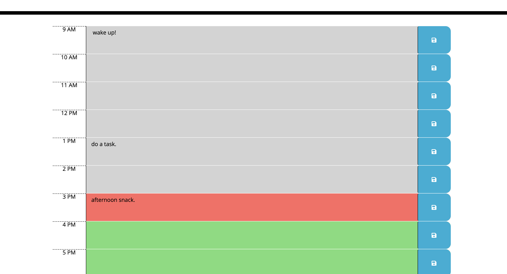

# Workday Scheduler
## by Aaron Rosenblatt
#### I wrote JavaScript code that works with provided CSS and HTML to create a calendar application that allows a user to save events for each hour of the day. The app runs in a browser and JavaScript uses the Moment.js library to work with date and time. The calendar application displays the current day and date at the top, standard business hours with time blocks, and the time blocks are color-coded to indicate whether they are past, present or future. When a time block is clicked, the user can enter an event and that event is saved in local storage when the save button is clicked. If the user refreshes the page the saved event will remain on the page. 

### The GitHub repository for the workday scheduler can be viewed here: https://github.com/noplur/workday-scheduler
### The link to the website of the workday scheduler can be viewed here: https://noplur.github.io/workday-scheduler/

### Here is a screenshot of the workday scheduler:
### 